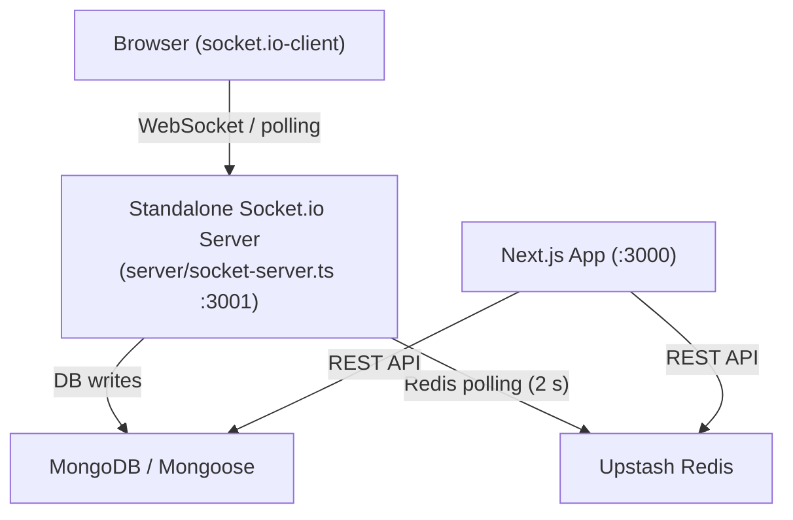
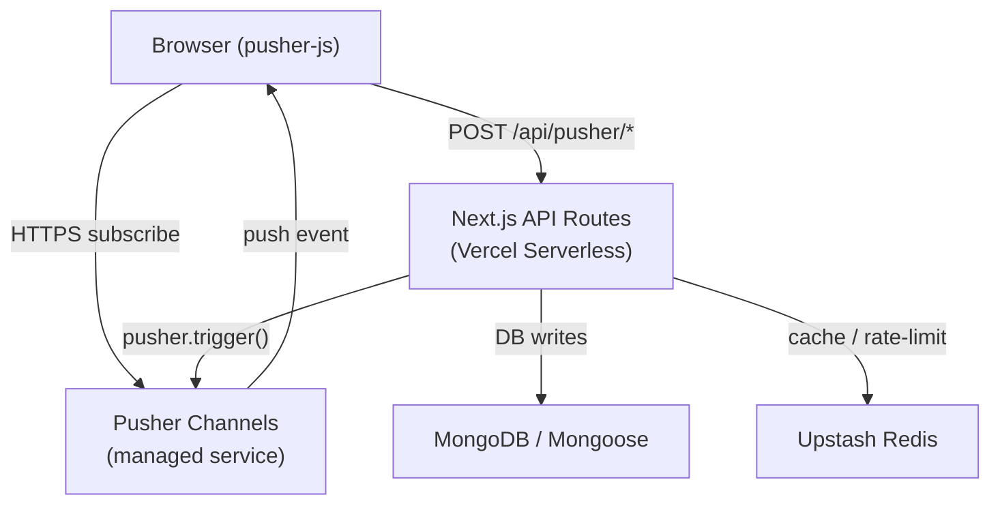
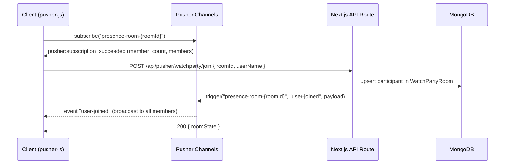
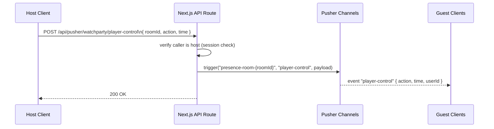
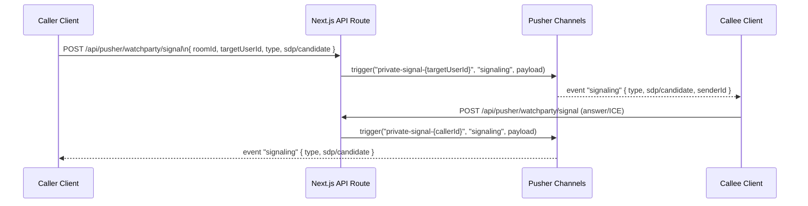
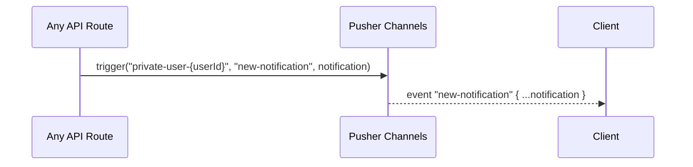

# Design Document: Pusher Real-Time Migration

## Overview

Replace the standalone Socket.io server (`server/socket-server.ts`) with Pusher Channels so that all real-time features — Watch Party room management, player sync, chat, WebRTC signaling, and notification delivery — run entirely inside Next.js API routes and are therefore compatible with Vercel's serverless deployment model.

The migration eliminates the need for a separate long-running process, removes the `socket.io` and `socket.io-client` npm packages, and replaces `lib/socket/client.ts` and `lib/websocket.ts` with a thin Pusher client wrapper. All existing feature contracts (join/leave rooms, play/pause/seek sync, chat, WebRTC offer/answer/ICE, notifications) are preserved; only the transport layer changes.

---

## Architecture

### Before (Socket.io)



### After (Pusher)



**Key architectural shift:** The browser no longer holds a persistent WebSocket to a custom server. Instead it subscribes to Pusher channels (which Pusher manages), and all state mutations go through normal Next.js API routes that call `pusher.trigger()` server-side.

---

## Sequence Diagrams

### Watch Party: Join Room



### Player Sync: Host Sends Play/Pause/Seek



### WebRTC Signaling: Offer/Answer/ICE



### Real-Time Notification Delivery



---

## Components and Interfaces

### Component 1: Pusher Server Client (`lib/pusher/server.ts`)

**Purpose:** Singleton Pusher server instance used by all API routes to trigger events.

**Interface:**

```typescript
import Pusher from "pusher";

export const pusherServer: Pusher;

// Convenience wrappers
export function triggerRoomEvent(
  roomId: string,
  event: string,
  data: unknown
): Promise<void>;

export function triggerUserEvent(
  userId: string,
  event: string,
  data: unknown
): Promise<void>;

export function triggerSignalEvent(
  targetUserId: string,
  event: string,
  data: unknown
): Promise<void>;
```

**Responsibilities:**
- Initialise `new Pusher(...)` once using env vars
- Expose typed helpers so API routes never construct channel names manually
- Channel naming conventions:
  - `presence-room-{roomId}` — Watch Party room (presence channel)
  - `private-user-{userId}` — Per-user notifications & device sync
  - `private-signal-{userId}` — WebRTC signaling target channel

---

### Component 2: Pusher Auth API Route (`app/api/pusher/auth/route.ts`)

**Purpose:** Authenticate private/presence channel subscriptions. Pusher calls this endpoint before granting access.

**Interface:**

```typescript
// POST /api/pusher/auth
// Body: { socket_id: string; channel_name: string }
// Returns: Pusher auth signature JSON

export async function POST(req: NextRequest): Promise<NextResponse>;
```

**Responsibilities:**
- Validate the caller's NextAuth session
- For presence channels: include `user_id` and `user_info` in the auth payload so Pusher tracks membership
- For private channels: sign with `pusherServer.authorizeChannel()`
- Reject unauthenticated requests with 401

---

### Component 3: Watch Party Event API Routes (`app/api/pusher/watchparty/`)

**Purpose:** Replace all Socket.io event handlers with HTTP endpoints.

| Route | Method | Replaces Socket.io event |
|---|---|---|
| `/api/pusher/watchparty/join` | POST | `join-room` |
| `/api/pusher/watchparty/leave` | POST | `leave-room` |
| `/api/pusher/watchparty/player-control` | POST | `play`, `pause`, `seek`, `sync-progress` |
| `/api/pusher/watchparty/chat` | POST | `chat-message` |
| `/api/pusher/watchparty/signal` | POST | `signaling` (offer/answer/ice-candidate) |
| `/api/pusher/watchparty/create` | POST | `create-room` |

**Shared interface pattern:**

```typescript
// All routes follow this shape
export async function POST(req: NextRequest): Promise<NextResponse> {
  const session = await getServerSession(authOptions);
  if (!session?.user?.id) return NextResponse.json({ error: "Unauthorized" }, { status: 401 });

  const body = await req.json();
  // validate body...
  // mutate MongoDB if needed...
  await triggerRoomEvent(body.roomId, "event-name", payload);
  return NextResponse.json({ success: true });
}
```

---

### Component 4: Notification Trigger Utility (`lib/pusher/notifications.ts`)

**Purpose:** Replace the Redis-polling bridge in `server/socket-server.ts` and `lib/websocket.ts` with a direct Pusher trigger.

**Interface:**

```typescript
export async function pushNotificationToUser(
  userId: string,
  notification: NotificationPayload
): Promise<void>;
```

**Responsibilities:**
- Call `triggerUserEvent(userId, "new-notification", notification)`
- Can be called from any API route (e.g. `/api/notifications`, `/api/watchparty`, etc.)
- Eliminates the 2-second Redis polling loop entirely

---

### Component 5: Pusher Client Hook (`lib/pusher/client.ts` + `hooks/usePusher.ts`)

**Purpose:** Replace `lib/socket/client.ts` and the Socket.io client usage in components.

**Interface:**

```typescript
// lib/pusher/client.ts
import Pusher from "pusher-js";

export function getPusherClient(): Pusher; // singleton

// hooks/usePusher.ts
export function usePusherChannel(channelName: string): Channel | null;

export function usePusherEvent<T = unknown>(
  channel: Channel | null,
  eventName: string,
  handler: (data: T) => void
): void;

export function usePresenceChannel(roomId: string): {
  channel: PresenceChannel | null;
  members: Record<string, MemberInfo>;
  myId: string | null;
};
```

**Responsibilities:**
- Initialise `new Pusher(NEXT_PUBLIC_PUSHER_KEY, { cluster, authEndpoint: "/api/pusher/auth" })` once
- Subscribe/unsubscribe on mount/unmount
- Expose typed event binding helpers
- `usePresenceChannel` provides live member list for the Watch Party participant panel

---

## Data Models

### WatchPartyRoom (existing — minor update)

The `socketId` field on `ParticipantSchema` becomes optional/deprecated since Pusher manages connection identity via `user_id` in presence channels.

```typescript
// models/WatchPartyRoom.ts — updated ParticipantSchema
const ParticipantSchema = new mongoose.Schema({
  userId:    { type: String, required: true },
  userName:  { type: String },
  socketId:  { type: String }, // deprecated — kept for backward compat, no longer written
  joinedAt:  { type: Date, default: Date.now },
  isHost:    { type: Boolean, default: false },
  isMuted:   { type: Boolean, default: false },
  isVideoOff:{ type: Boolean, default: false }
}, { _id: false });
```

### Pusher Presence Member Info

```typescript
interface PusherMemberInfo {
  userId: string;   // maps to NextAuth session.user.id
  userName: string;
  isHost: boolean;
}
```

### Player Control Payload

```typescript
interface PlayerControlPayload {
  action: "play" | "pause" | "seek";
  time?: number;       // seconds — required for seek
  userId: string;
  userName: string;
  timestamp: number;   // Date.now() for latency compensation
}
```

### Chat Message Payload

```typescript
interface ChatMessagePayload {
  id: string;
  userId: string;
  userName: string;
  message: string;
  timestamp: string; // ISO
  type: "text";
}
```

### Signaling Payload

```typescript
interface SignalingPayload {
  type: "offer" | "answer" | "ice-candidate";
  sdp?: RTCSessionDescriptionInit;
  candidate?: RTCIceCandidateInit;
  senderId: string;
  senderName: string;
  roomId: string;
}
```

---

## Algorithmic Pseudocode

### Pusher Auth Endpoint

```pascal
PROCEDURE handlePusherAuth(request)
  INPUT: request with body { socket_id, channel_name }
  OUTPUT: Pusher auth JSON or error

  BEGIN
    session ← getServerSession(authOptions)
    
    IF session IS NULL OR session.user.id IS NULL THEN
      RETURN 401 Unauthorized
    END IF
    
    { socket_id, channel_name } ← parseBody(request)
    
    IF channel_name STARTS WITH "presence-" THEN
      userData ← {
        user_id: session.user.id,
        user_info: { userName: session.user.name, isHost: false }
      }
      auth ← pusherServer.authorizeChannel(socket_id, channel_name, userData)
    ELSE IF channel_name STARTS WITH "private-" THEN
      // Validate user owns this channel
      expectedUserId ← extractUserIdFromChannel(channel_name)
      IF expectedUserId ≠ session.user.id THEN
        RETURN 403 Forbidden
      END IF
      auth ← pusherServer.authorizeChannel(socket_id, channel_name)
    ELSE
      RETURN 403 Forbidden
    END IF
    
    RETURN 200 auth
  END
END PROCEDURE
```

**Preconditions:**
- `socket_id` and `channel_name` are present in request body
- NextAuth session is valid

**Postconditions:**
- Returns signed auth token for Pusher to verify
- Presence channels include `user_id` so Pusher tracks membership

---

### Join Room Handler

```pascal
PROCEDURE handleJoinRoom(request)
  INPUT: { roomId, userName }
  OUTPUT: { roomState } or error

  BEGIN
    session ← getServerSession(authOptions)
    IF NOT authenticated THEN RETURN 401 END IF
    
    { roomId, userName } ← parseAndValidate(request)
    
    await connectDB()
    
    room ← WatchPartyRoom.findOne({ roomId })
    
    IF room IS NULL THEN
      RETURN 404 "Room not found"
    END IF
    
    IF room.participants.length >= room.maxParticipants THEN
      RETURN 400 "Room is full"
    END IF
    
    IF room.isPrivate AND NOT passwordMatches THEN
      RETURN 403 "Incorrect password"
    END IF
    
    isHost ← (room.hostId.toString() = session.user.id)
    
    participant ← {
      userId: session.user.id,
      userName,
      joinedAt: now(),
      isHost,
      isMuted: false,
      isVideoOff: false
    }
    
    // Upsert: avoid duplicate entries on reconnect
    WatchPartyRoom.findOneAndUpdate(
      { roomId, "participants.userId": { $ne: session.user.id } },
      { $push: { participants: participant } }
    )
    
    // Broadcast to room via Pusher
    triggerRoomEvent(roomId, "user-joined", {
      userId: session.user.id,
      userName,
      isHost
    })
    
    RETURN 200 {
      roomId,
      movieId: room.movieId,
      playState: room.currentPlayState,
      currentTime: room.currentTime,
      participants: room.participants
    }
  END
END PROCEDURE
```

**Preconditions:**
- `roomId` exists in MongoDB
- Caller is authenticated

**Postconditions:**
- Participant added to DB (idempotent — no duplicate on reconnect)
- All room members receive `user-joined` event via Pusher

---

### Player Control Handler

```pascal
PROCEDURE handlePlayerControl(request)
  INPUT: { roomId, action, time? }
  OUTPUT: 200 OK or error

  BEGIN
    session ← getServerSession(authOptions)
    IF NOT authenticated THEN RETURN 401 END IF
    
    { roomId, action, time } ← parseAndValidate(request)
    
    room ← WatchPartyRoom.findOne({ roomId })
    IF room IS NULL THEN RETURN 404 END IF
    
    // Only host may control playback
    IF room.hostId.toString() ≠ session.user.id THEN
      RETURN 403 "Only host can control playback"
    END IF
    
    SWITCH action
      CASE "play":
        updateData ← { currentPlayState: "playing", lastUpdated: now() }
      CASE "pause":
        updateData ← { currentPlayState: "paused", lastUpdated: now() }
      CASE "seek":
        ASSERT time IS NOT NULL
        updateData ← { currentTime: time, lastUpdated: now() }
    END SWITCH
    
    WatchPartyRoom.findOneAndUpdate({ roomId }, updateData)
    
    triggerRoomEvent(roomId, "player-control", {
      action,
      time,
      userId: session.user.id,
      userName: session.user.name,
      timestamp: Date.now()
    })
    
    RETURN 200 { success: true }
  END
END PROCEDURE
```

**Preconditions:**
- Caller is the room host
- `action` is one of `play | pause | seek`
- `time` is a non-negative number when `action = "seek"`

**Postconditions:**
- Room state persisted in MongoDB
- All participants receive `player-control` event within Pusher's delivery SLA (~100 ms)

---

### WebRTC Signaling Handler

```pascal
PROCEDURE handleSignaling(request)
  INPUT: { roomId, targetUserId, type, sdp?, candidate? }
  OUTPUT: 200 OK or error

  BEGIN
    session ← getServerSession(authOptions)
    IF NOT authenticated THEN RETURN 401 END IF
    
    { roomId, targetUserId, type, sdp, candidate } ← parseAndValidate(request)
    
    // Validate sender is in the room
    room ← WatchPartyRoom.findOne({ roomId })
    senderInRoom ← room.participants.some(p => p.userId = session.user.id)
    IF NOT senderInRoom THEN RETURN 403 END IF
    
    // Route signal to target via their private channel
    triggerSignalEvent(targetUserId, "signaling", {
      type,
      sdp,
      candidate,
      senderId: session.user.id,
      senderName: session.user.name,
      roomId
    })
    
    RETURN 200 { success: true }
  END
END PROCEDURE
```

**Preconditions:**
- Both sender and target are participants in the same room
- `type` is one of `offer | answer | ice-candidate`

**Postconditions:**
- Signal delivered to `private-signal-{targetUserId}` channel
- No signal data is stored server-side (ephemeral relay)

---

## Key Functions with Formal Specifications

### `triggerRoomEvent(roomId, event, data)`

**Preconditions:**
- `roomId` is a non-empty string matching an existing room
- `event` is a valid Pusher event name (≤ 200 chars)
- `data` is JSON-serialisable

**Postconditions:**
- Pusher delivers `event` to all subscribers of `presence-room-{roomId}`
- Returns `void`; throws on Pusher API error

**Loop Invariants:** N/A

---

### `getPusherClient()`

**Preconditions:**
- `NEXT_PUBLIC_PUSHER_KEY` and `NEXT_PUBLIC_PUSHER_CLUSTER` are defined in the browser environment

**Postconditions:**
- Returns the same `Pusher` instance on every call (singleton)
- Instance is configured with `authEndpoint: "/api/pusher/auth"` and `authTransport: "ajax"`

---

### `usePresenceChannel(roomId)`

**Preconditions:**
- Called inside a React component
- User is authenticated (NextAuth session exists)

**Postconditions:**
- Returns `{ channel, members, myId }` where `members` is always the current live member map
- Subscribes on mount, unsubscribes on unmount
- `members` updates reactively on `pusher:member_added` and `pusher:member_removed`

---

## Example Usage

### Server-side: Trigger a notification from any API route

```typescript
// In any Next.js API route (e.g. app/api/notifications/route.ts)
import { pushNotificationToUser } from "@/lib/pusher/notifications";

// After creating a notification in MongoDB:
await pushNotificationToUser(session.user.id, {
  id: notification._id.toString(),
  type: "watch_party_invite",
  message: `${inviterName} invited you to a Watch Party`,
  createdAt: new Date().toISOString(),
});
```

### Client-side: Subscribe to a Watch Party room

```typescript
// In a Watch Party page component
import { usePresenceChannel, usePusherEvent } from "@/hooks/usePusher";

function WatchPartyRoom({ roomId }: { roomId: string }) {
  const { channel, members } = usePresenceChannel(roomId);

  // Listen for player control events
  usePusherEvent<PlayerControlPayload>(channel, "player-control", (data) => {
    if (data.action === "play")  videoRef.current?.play();
    if (data.action === "pause") videoRef.current?.pause();
    if (data.action === "seek")  videoRef.current!.currentTime = data.time!;
  });

  // Listen for chat messages
  usePusherEvent<ChatMessagePayload>(channel, "chat-message", (msg) => {
    setMessages(prev => [...prev, msg]);
  });

  // Listen for WebRTC signals on private channel
  const signalChannel = usePusherChannel(`private-signal-${myUserId}`);
  usePusherEvent<SignalingPayload>(signalChannel, "signaling", handleSignal);

  // Send a player control action (host only)
  const sendPlay = async () => {
    await fetch("/api/pusher/watchparty/player-control", {
      method: "POST",
      body: JSON.stringify({ roomId, action: "play" }),
    });
  };
}
```

### Client-side: Subscribe to notifications

```typescript
// In a global layout or notification hook
import { usePusherChannel, usePusherEvent } from "@/hooks/usePusher";

function NotificationListener({ userId }: { userId: string }) {
  const channel = usePusherChannel(`private-user-${userId}`);

  usePusherEvent(channel, "new-notification", (notification) => {
    toast(notification.message);
    queryClient.invalidateQueries(["notifications"]);
  });

  return null;
}
```

---

## Correctness Properties

*A property is a characteristic or behavior that should hold true across all valid executions of a system — essentially, a formal statement about what the system should do. Properties serve as the bridge between human-readable specifications and machine-verifiable correctness guarantees.*

### Property 1: Auth Gate

*For any* request to any `/api/pusher/watchparty/*` or `/api/pusher/auth` route where `session.user.id` is absent or the session is invalid, the response status SHALL be 401.

**Validates: Requirements 2.2, 3.2, 4.2, 5.2, 6.5, 7.2, 8.2**

---

### Property 2: Channel Name Construction

*For any* `roomId` string, `triggerRoomEvent` SHALL construct the channel name `presence-room-{roomId}`; *for any* `userId` string, `triggerUserEvent` SHALL construct `private-user-{userId}`; *for any* `targetUserId` string, `triggerSignalEvent` SHALL construct `private-signal-{targetUserId}`. No helper SHALL ever produce a public (unprefixed) channel name.

**Validates: Requirements 1.2, 1.3, 1.4, 9.1, 12.1**

---

### Property 3: Channel Name Length Safety

*For any* `roomId`, `userId`, or `targetUserId` string, the channel name produced by the corresponding helper SHALL be no longer than 200 characters (Pusher's channel name limit).

**Validates: Requirements 1.2, 1.3, 1.4**

---

### Property 4: Auth Isolation — Signal Channel

*For any* `userId` and any `session.user.id` that differs from `userId`, a POST to `/api/pusher/auth` requesting `private-signal-{userId}` SHALL return HTTP 403.

**Validates: Requirements 2.4, 12.2**

---

### Property 5: Auth Isolation — Public Channel Rejection

*For any* channel name that does not start with `private-` or `presence-`, a POST to `/api/pusher/auth` SHALL return HTTP 403 regardless of session validity.

**Validates: Requirements 2.5, 12.1**

---

### Property 6: Presence Auth Payload Completeness

*For any* valid authenticated request to `/api/pusher/auth` for a `presence-` channel, the returned auth payload SHALL contain `user_id` equal to `session.user.id` and a `user_info` object containing at least `userName`.

**Validates: Requirements 2.3**

---

### Property 7: Host-Only Playback Enforcement

*For any* `player-control` request where `session.user.id` does not equal `room.hostId`, the response status SHALL be 403 and `pusherServer.trigger()` SHALL NOT be called.

**Validates: Requirements 6.4, 12.3**

---

### Property 8: Player State Persistence

*For any* valid `play` or `pause` action submitted by the Host, the `WatchPartyRoom` document's `currentPlayState` SHALL be updated to match the action (`"playing"` or `"paused"` respectively), and a `player-control` event SHALL be triggered on the Presence_Channel.

**Validates: Requirements 6.1, 6.2**

---

### Property 9: Seek State Persistence

*For any* valid `seek` action with a non-negative `time` value submitted by the Host, the `WatchPartyRoom` document's `currentTime` SHALL be updated to that value, and a `player-control` event SHALL be triggered on the Presence_Channel.

**Validates: Requirements 6.3**

---

### Property 10: PlayerControlPayload Completeness

*For any* valid player-control action, the Pusher event payload SHALL contain all of `action`, `userId`, `userName`, and `timestamp`; `time` SHALL be present when `action` is `"seek"`.

**Validates: Requirements 6.6**

---

### Property 11: Idempotent Room Join

*For any* user who is already a participant in a room, submitting a join request SHALL NOT increase the length of the `participants` array in MongoDB — the `$push` is guarded by `{ "participants.userId": { $ne: userId } }`.

**Validates: Requirements 4.6**

---

### Property 12: Join Response Shape

*For any* successful join request, the response body SHALL contain all of `roomId`, `movieId`, `playState`, `currentTime`, and `participants`.

**Validates: Requirements 4.8**

---

### Property 13: Room Capacity Enforcement

*For any* room where `participants.length >= maxParticipants`, a join request SHALL return HTTP 400 and the participant list SHALL remain unchanged.

**Validates: Requirements 4.4**

---

### Property 14: Private Room Password Enforcement

*For any* private room and *for any* password string that does not match `room.password`, a join request SHALL return HTTP 403 and the participant list SHALL remain unchanged.

**Validates: Requirements 4.5**

---

### Property 15: Unique Room ID Generation

*For any* set of N room creation requests, all N generated `roomId` values SHALL be distinct.

**Validates: Requirements 3.5**

---

### Property 16: Host Assignment on Room Creation

*For any* valid room creation request, the `hostId` field on the created `WatchPartyRoom` document SHALL equal `session.user.id` of the requesting user.

**Validates: Requirements 3.3**

---

### Property 17: Whitespace Chat Message Rejection

*For any* `message` string composed entirely of whitespace characters, a POST to `/api/pusher/watchparty/chat` SHALL return HTTP 400, SHALL NOT persist the message to `chatHistory`, and SHALL NOT call `pusherServer.trigger()`.

**Validates: Requirements 7.3**

---

### Property 18: ChatMessagePayload Completeness

*For any* valid chat message, the Pusher event payload SHALL contain all of `id`, `userId`, `userName`, `message`, `timestamp` (ISO string), and `type: "text"`.

**Validates: Requirements 7.4**

---

### Property 19: Signaling Channel Isolation

*For any* signaling request with `targetUserId`, the Pusher trigger SHALL target `private-signal-{targetUserId}` exclusively — no other channel SHALL receive the signal event.

**Validates: Requirements 8.1, 8.3**

---

### Property 20: SignalingPayload Completeness

*For any* valid signaling request, the Pusher event payload SHALL contain `type`, `senderId`, `senderName`, and `roomId`; `sdp` SHALL be present for `offer`/`answer` types; `candidate` SHALL be present for `ice-candidate` type.

**Validates: Requirements 8.4**

---

### Property 21: Notification Channel Isolation

*For any* call to `pushNotificationToUser(userId, notification)`, the Pusher trigger SHALL target `private-user-{userId}` and the full `notification` object SHALL be included in the event data unchanged.

**Validates: Requirements 9.1, 9.3**

---

### Property 22: Pusher Error Propagates as HTTP 500

*For any* WatchParty API route where `pusherServer.trigger()` throws an error, the route SHALL catch the error and return HTTP 500 to the client.

**Validates: Requirements 14.1, 14.5**

---

### Property 23: Presence Membership Reactivity

*For any* sequence of `pusher:member_added` and `pusher:member_removed` events on a Presence_Channel, the `members` map returned by `usePresenceChannel` SHALL reflect the current live membership after each event — members added SHALL appear in the map, members removed SHALL not appear in the map.

**Validates: Requirements 10.5, 10.6**

---

### Property 24: Pusher Client Singleton

*For any* number of calls to `getPusherClient()` within the same browser session, all calls SHALL return the same `Pusher` instance (reference equality).

**Validates: Requirements 10.1**

---

### Property 25: No socketId Written on Join

*For any* participant document created by `/api/pusher/watchparty/join` after migration, the `socketId` field SHALL be absent or `undefined` — it SHALL NOT be set to any value.

**Validates: Requirements 13.1, 13.2**

---

### Property 26: Payload JSON Serialisability

*For any* `PlayerControlPayload`, `ChatMessagePayload`, or `SignalingPayload` instance, `JSON.stringify(payload)` SHALL complete without throwing.

**Validates: Requirements 6.6, 7.4, 8.4**

---

## Error Handling

### Pusher API Unavailable

**Condition:** `pusherServer.trigger()` throws a network or API error.
**Response:** API route catches the error, logs it, and returns 500 to the client.
**Recovery:** Client retries the action (e.g. re-sends play command). Pusher has 99.999% uptime SLA; transient failures are rare.

### Auth Endpoint Returns 401/403

**Condition:** User's session has expired when Pusher calls `/api/pusher/auth`.
**Response:** Pusher rejects the subscription; `pusher-js` emits `pusher:subscription_error`.
**Recovery:** Client detects the error, redirects to sign-in, and re-subscribes after authentication.

### Presence Channel Member Count Mismatch

**Condition:** A client disconnects without calling `/api/pusher/watchparty/leave` (e.g. browser crash).
**Response:** Pusher automatically removes the member from the presence channel and emits `pusher:member_removed` to remaining subscribers.
**Recovery:** The client-side `usePresenceChannel` hook updates `members` reactively. A periodic reconciliation call to `/api/pusher/watchparty/join` on reconnect re-syncs MongoDB.

### WebRTC Signal to Offline Target

**Condition:** `targetUserId` is not subscribed to `private-signal-{targetUserId}`.
**Response:** Pusher silently drops the event (no error). The API route returns 200.
**Recovery:** The calling client's WebRTC connection attempt times out; the UI shows a "peer unavailable" message.

---

## Testing Strategy

### Unit Testing Approach

- Test each API route handler in isolation by mocking `pusherServer.trigger()` and MongoDB calls.
- Verify auth guard: unauthenticated requests return 401.
- Verify host guard: non-host player-control requests return 403.
- Verify channel name construction: `presence-room-{roomId}`, `private-user-{userId}`, `private-signal-{userId}`.

### Property-Based Testing Approach

**Property Test Library:** `fast-check`

- **Channel name safety:** For any `roomId` string, `triggerRoomEvent` never constructs a channel name longer than 200 characters (Pusher limit).
- **Payload serialisability:** For any `PlayerControlPayload`, `ChatMessagePayload`, or `SignalingPayload`, `JSON.stringify(payload)` never throws.
- **Auth isolation:** For any `userId` and `channelName` where `channelName` does not contain `userId`, the auth endpoint returns 403.

### Integration Testing Approach

- Use Pusher's sandbox/test credentials to verify end-to-end event delivery in a staging environment.
- Test presence channel membership: join → verify member appears → leave → verify member removed.
- Test notification flow: call `pushNotificationToUser` → verify client receives `new-notification` event.

---

## Performance Considerations

- **Pusher free tier:** 100 concurrent connections, 200k messages/day. Upgrade to the Starter plan ($49/mo) for 500 connections and 3M messages/day — sufficient for a streaming platform MVP.
- **Event size limit:** Pusher enforces a 10 KB payload limit per event. Chat messages and signaling payloads are well within this. Large SDP offers (~2–4 KB) are safe.
- **Latency:** Pusher's median delivery latency is ~50–100 ms globally, which is acceptable for player sync (Socket.io had similar latency over the public internet).
- **Presence channel overhead:** Each presence subscription triggers an auth round-trip. For Watch Party rooms with ≤ 10 participants this is negligible.
- **Redis polling removal:** Eliminating the 2-second polling loop in `setupRedisSubscription` reduces Upstash read operations significantly.

---

## Security Considerations

- **Private/presence channels:** All Watch Party and notification channels are `private-` or `presence-` prefixed, requiring server-side auth. Public channels are not used.
- **Auth endpoint validation:** The `/api/pusher/auth` route validates the NextAuth session and, for `private-signal-{userId}` channels, asserts that the requesting user's `session.user.id` matches the `userId` in the channel name — preventing users from subscribing to other users' signal channels.
- **PUSHER_SECRET never exposed:** `PUSHER_APP_ID`, `PUSHER_KEY`, `PUSHER_SECRET`, and `PUSHER_CLUSTER` are server-only env vars. Only `NEXT_PUBLIC_PUSHER_KEY` and `NEXT_PUBLIC_PUSHER_CLUSTER` are exposed to the browser.
- **Host verification server-side:** Player control actions verify host identity in the API route against MongoDB — the client cannot spoof host status.
- **No persistent socket token:** The existing `/api/auth/socket-token` route becomes unused and can be removed.

---

## Dependencies

### To Add

| Package | Version | Purpose |
|---|---|---|
| `pusher` | `^5.2.0` | Server-side Pusher SDK (API routes) |
| `pusher-js` | `^8.4.0` | Client-side Pusher SDK (browser) |

### To Remove

| Package | Reason |
|---|---|
| `socket.io` | Replaced by Pusher server SDK |
| `socket.io-client` | Replaced by `pusher-js` |
| `@types/socket.io` | No longer needed |

### Environment Variables

```dotenv
# Server-only (never expose to browser)
PUSHER_APP_ID=your-pusher-app-id
PUSHER_KEY=your-pusher-key
PUSHER_SECRET=your-pusher-secret
PUSHER_CLUSTER=your-pusher-cluster   # e.g. us2, eu, ap2

# Public (safe to expose)
NEXT_PUBLIC_PUSHER_KEY=your-pusher-key
NEXT_PUBLIC_PUSHER_CLUSTER=your-pusher-cluster
```

### Files to Delete After Migration

- `server/socket-server.ts`
- `server/load-env.ts` (if it only exists to support the socket server)
- `lib/socket/client.ts`
- `lib/websocket.ts` (WebSocketManager class — replaced by Pusher client)

### Files to Update After Migration

- `lib/websocket.ts` → delete or replace with `lib/pusher/client.ts`
- `lib/redis.ts` → remove `setupRedisSubscription` polling logic
- `models/WatchPartyRoom.ts` → mark `socketId` as deprecated
- `package.json` → remove socket.io deps, add pusher deps, remove `socket:*` scripts
- `.env.example` → add Pusher env var documentation
- `app/ClientLayout.tsx` → replace Socket.io provider with Pusher client initialisation
